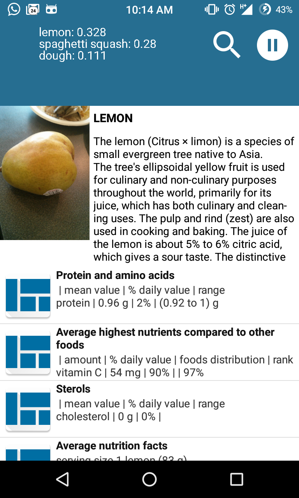
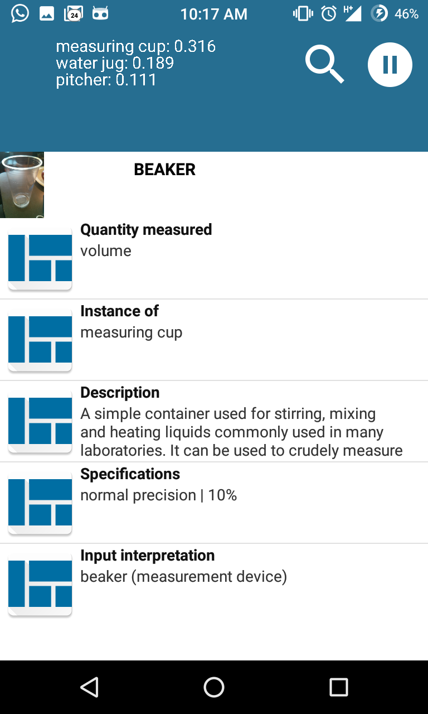
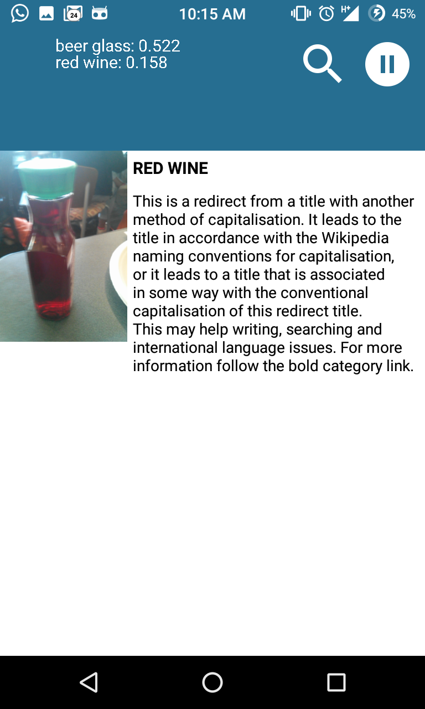
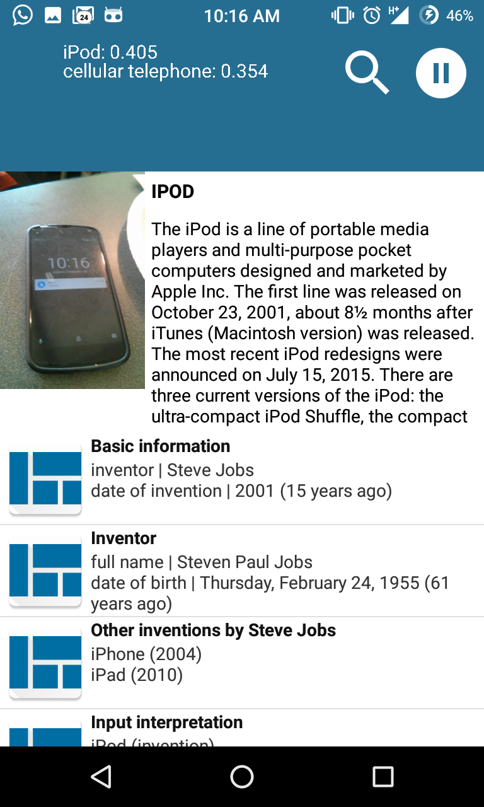

Paideia
=======

Paideia aims at making lives easier for all of us by brining knowlege that we need in day to day lives one step closer to all of us. This is an android app using which one can point their phone at quite literally anything and get information about it. For instance, when you want to know more about the fruit that is sitting beside you or when you just want to "learn" more about the stuff that is around you, Paideia helps you start off. Here is some of the info given by Paideia about random stuff that is around us:

 &nbsp;&nbsp;  &nbsp;&nbsp;  &nbsp;&nbsp;  &nbsp;&nbsp; 

Seriously, the kind of information we get through Paideia by observing normal things around us is amazing!

##What can it do?

1. Detects objects around us.
2. Has inbuilt Text-to-speech system that can read it out. This can greatly help people with who are specially abled.
3. Extracts useful and relavent information from Wikipedia and Wolfram Alpha.
4. Users can set preferences which allows Paideia to customize what they see.

##How does it do?

1. We use a *deep learning* model trained using Tensorflow on Imagenet ILSVRC2012 data to recognize images from live feed. 
2. We use API's provided by Wolfram Alpha and Wikipedia in order to extract relavent information to the user.
3. We use a simple learning approach to customize feeds for users based on their usage pattern.
4. Google tts system to read out information to the user.

##Who does it help?
1. Children who want to learn more.
2. Adults who want to learn more.
3. Specially abled people who want to learn more.
4. So basically, everyone who wanna learn more.

